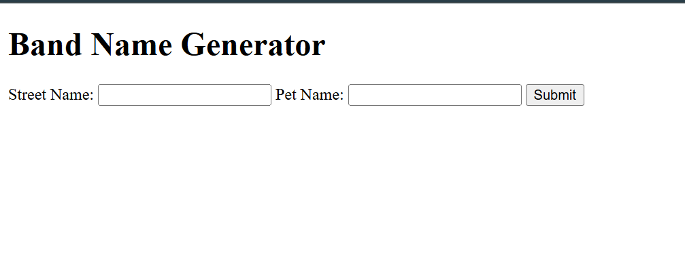

# Brand Name Generator

  

Simple String Concatenation App

## Table of Contents

- [About The Project](#about-the-project)
- [Features](#features)
- [Getting Started](#getting-started)
  - [Prerequisites](#prerequisites)
  - [Installation](#installation)
- [Usage](#usage)
- [Roadmap](#roadmap)
- [Contributing](#contributing)
- [License](#license)
- [Contact](#contact)
- [Acknowledgments](#acknowledgments)

## About The Project

This project is a basic web application built to practice Node.js and Express.js fundamentals. It demonstrates a simple client-server interaction where two strings are submitted from a frontend form, concatenated (added together) on the backend using Express.js, and then displayed on a new page.

This was a hands-on exercise to understand:

Setting up an Express.js server.

Handling GET and POST requests.

Accessing form data from the client-side.

Rendering dynamic content on the server.



## Features

The key features and functionalities of the project.

- Feature 1: String concatenated
- Feature 2: Stablising Node.js and Express.js
- Feature 3: Handling GET and POST request

## Getting Started

This section will guide users on how to set up your project locally.

### Prerequisites

Software, libraries, or tools that need to be installed before running your project.

- `npm`
  ```sh
  npm install npm@latest -g
  ```
- Git
- Node.js

### Installation

Step-by-step instructions on how to get your development environment running.

1.  Clone the repo
    ```sh
    git clone [https://github.com/your_username/your_project.git](https://github.com/your_username/your_project.git)
    ```
2.  Navigate into the project directory
    ```sh
    cd your_project
    ```
3.  Install dependencies (example for Node.js/Python)

    ```sh
    npm install body-parser express path url

    ```

4.  Set up environment variables (if any). You might mention creating a `.env` file from a `.env.example`.

## Usage

Provide examples of how to use your project. This could include code snippets, commands, or walkthroughs.

```python
# Example Python usage
from your_project import some_function

result = some_function("Hello, World!")
print(result)
```
